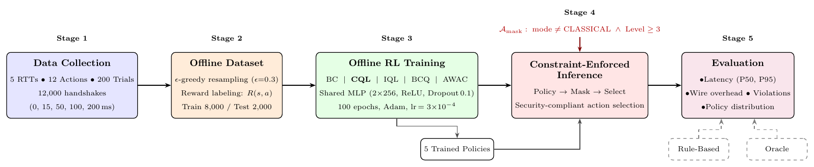
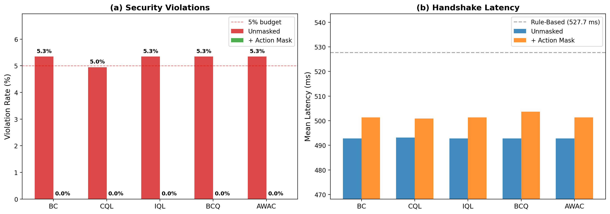
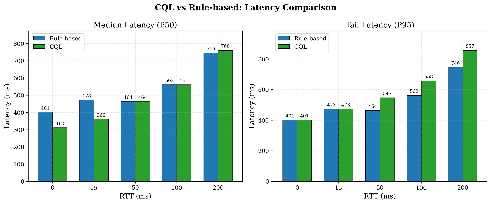
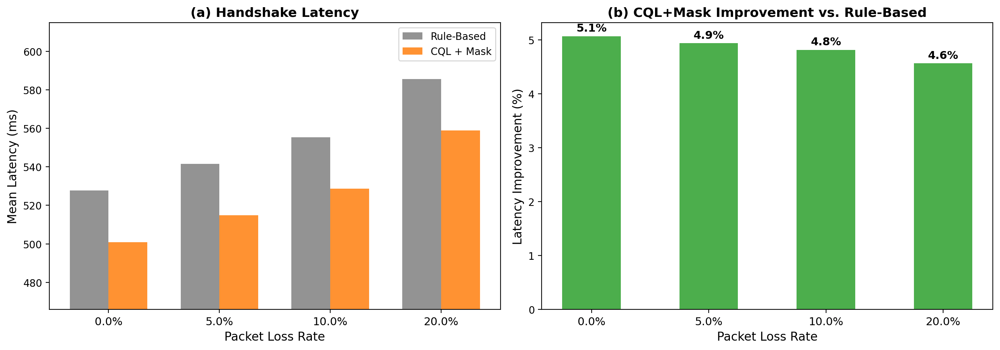

# Adaptive Post-Quantum TLS Policy Selection with Offline RL

Code and data for **"An Intelligent Cryptographic Agility Framework for Adaptive Post-Quantum TLS Policy Selection Using Offline Reinforcement Learning"**, IEEE GLOBECOM 2026.
Md Shawmoon Azad, Sathish A. P. Kumar, Cleveland State University.

Choosing a TLS 1.3 post-quantum configuration trades handshake latency against cryptographic strength, and the right choice depends on network conditions. We learn that policy offline from 12,000 measured handshakes and enforce the security floor with inference-time action masking, so an unsafe configuration can never be selected.



Twelve actions (4 modes x 3 NIST levels), a 15-dimensional state, one decision per handshake.

## Results

Held-out set of 2,000 states.

| Method | Reward | Latency (ms) | Wire (B) | Hybrid % | Violation % |
|---|---|---|---|---|---|
| Oracle | -5.68 | 489.9 | 2466 | 100.0 | 0.0 |
| **CQL + Mask** | **-6.54** | **500.9** | **2386** | 75.8 | **0.0** |
| Rule-based | -7.02 | 527.7 | 2591 | 59.9 | 0.0 |
| Random-Safe | -8.15 | 535.6 | 2416 | 33.3 | 0.0 |
| CQL (no mask) | -7.16 | 493.2 | 2317 | 75.8 | 5.0 |
| BC / IQL / BCQ / AWAC (no mask) | -7.28 | 492.8 | 2314 | 75.8 | 5.4 |

**5.1% lower latency than the rule-based baseline, with zero violations.** Random-Safe draws uniformly from the six actions the mask allows, which separates the two mechanisms: masking supplies the guarantee, the learned policy supplies the 34.7 ms.



Masking zeroes violations for all five methods at a cost of 7.8 ms.



Gains concentrate at low RTT, a 22 to 24% median reduction. At 200 ms the medians converge and P95 is worse, 857 ms against 746 ms.



Trained only on loss-free data, the policy holds a 26.7 ms advantage from 0 to 20% loss.

### Reward ablation

| Configuration | Latency (ms) | Wire (B) | Hybrid % |
|---|---|---|---|
| Full reward | 501.6 | 2402 | 76.6 |
| No mode bonus | 494.5 | 1742 | 16.1 |
| No latency penalty | 577.6 | 3074 | 75.7 |
| No wire penalty | 501.0 | 2386 | 75.1 |

The mode bonus drives hybrid preference, the latency penalty drives efficiency, the wire penalty does little on its own.

## Reproduce

```bash
pip install -r requirements.txt
python scripts/verify_paper_numbers.py     # Table I and the 5.1% headline
python scripts/run_option_b_analysis.py    # Random-Safe, agreement, sensitivity
```

Both read the committed dataset and checkpoints. No GPU, no retraining, a few seconds.

To rebuild from scratch: `run_pipeline_v2.py` (measure, build dataset), `run_rl_pipeline.py` (train), then `run_action_masking_eval.py`, `run_packet_loss_eval.py`, `run_ablation_study.py`.

## Layout

```
hybrid_pqc_tls/   library: primitives, handshake harness, RL models, evaluation
scripts/          entry points; start with verify_paper_numbers.py
results/          12,000 handshakes, offline dataset, 5 trained policies, outputs
docs/DATA.md      dataset schema
```

## What the measurements are

Cryptography is real: every handshake runs actual ML-KEM and ML-DSA operations, timed with a monotonic clock. Network delay is emulated per flight rather than measured over a live link, packet loss comes from a Monte Carlo retransmission model, and the testbed is a standalone harness rather than OpenSSL. Results therefore exclude CPU contention, middlebox interference, and certificate chain effects.

## Known limitations

BC, IQL, BCQ and AWAC select identical actions on 100% of test states, so this dataset cannot distinguish them; the epsilon-greedy behavior policy lacks diversity. A constant HYBRID L3 policy reaches 489.9 ms, so within the tested RTT range adaptivity contributes less than the framing suggests. Handshake selection is modeled as one step, ignoring session resumption and server load. Tail latency degrades at high RTT. There is no adversary in the threat model, although the policy consumes network telemetry an on-path attacker could influence.

## Citation

```bibtex
@inproceedings{azad2026cryptoagility,
  author    = {Azad, Md Shawmoon and Kumar, Sathish A. P.},
  title     = {An Intelligent Cryptographic Agility Framework for Adaptive
               Post-Quantum {TLS} Policy Selection Using Offline
               Reinforcement Learning},
  booktitle = {IEEE Global Communications Conference (GLOBECOM)},
  year      = {2026}
}
```

MIT licensed. Contact: m.azad@vikes.csuohio.edu
